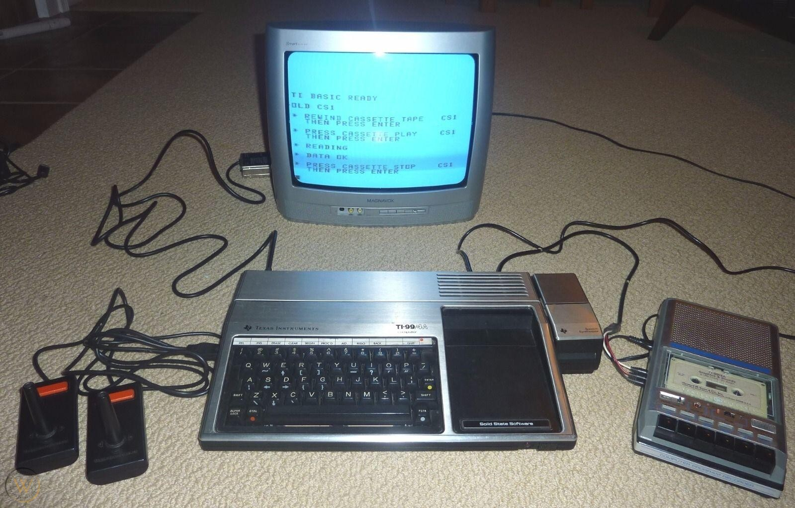
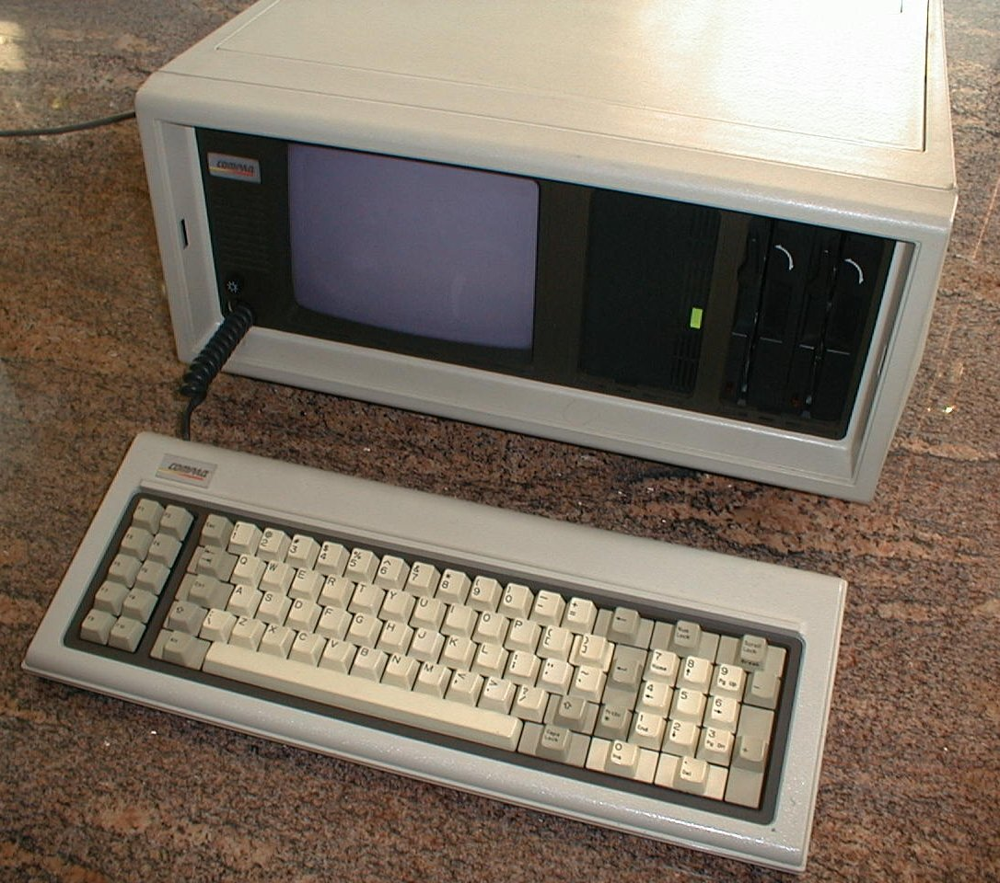

+++
title = "About"
description = "About the creator of this Decentralized Blog, or Dlog, if you will"
author = "MaTTeo DeCaPa"
date = "2021-02-28"
layout = "about"
+++

Podcasts I listen to often ask their guests to provide an “origin” story about their background and experiences that led up to their current field of work or interest.   Here is mine …

I became fascinated with the internet in the mid 90’s when I realized it would transform the world.  After purchasing my first “real” computer, I began learning as much as I could.  BTW, “first real” computer to me a is a computing device with a hard drive, and modem.  I’m not counting the 80’s era TI-99-4a from my youth.  Don't you love the cassette tape for mass storage?  

    
 


 I also don't consider the DOS 1.0 Compaq luggable that I traded my guitar and amp for in college either.  I'm thinking I got the worst of that deal, because the guitar and amp would still be working, and I'd surely be a rock star by now.
 
    


Everything that was necessary to learn and do to create a website led me to eventually leave my job at a bank and jump into a passion that was love at first sight.   I added a section to my site called “the proposal”, which documented how I asked girl friend to marry me.  Even though the term hadn’t been named yet, I created a blog!  The sites primary draw was “An Introduction to the Internet”, and it opened a few doors for me.   I still have an email from alan@yahoo.com, who let me know that he had categorized my website for Yahoo.  Still funny when I think about how small Yahoo must have been to give its employees an email with only a first name.

After taking a few classes at a local university, I obtained an IT position.   I attended university part-time eventually earning a degree in Computer Programming Technology.  It led me to a programmer analyst position which allowed me to gain experience and skills.   The degree opened a few doors for me, but it was my passion and love of the tech which enabled all the opportunities that I’ve taken advantage of while rising thru the ranks of IT.
 
A few years passed, and again, I pivoted my career, taking knowledge and experience with me from application development, enterprise architecture, and integration architecture to wrap that into a focus on security and protecting data and applications.  Application Security became my passion, and I took great satisfaction with identifying and helping developers and product teams ensure a secure product from the start of development.  I felt that getting security correct from the beginning to prevent an offensive attack against software in production was the best approach.  Security-first, entailed awareness, training, and the right tools at the right time to create a secure product.

Along with creating secure software in the new world of cloud computing, it is additionally necessary to ensure the product is configured securely as well.  A misconfigured application is as big of a problem as is producing insecure code.   In the world of Infrastructure As Code, there really isn’t a difference, is there?

My career has focused on protecting an individual’s right to have a secure virtual presence, while working for various companies.   As big tech business models monetized the individual’s personal information, they became the wealthiest companies the world has seen and maybe more powerful than individual nations themselves.  The rights of individuals and an individual's right to privacy doesn’t exist anymore.   The tech oligarchs provide free services and tell us we should be happy with it and accept the control they have over our lives. Remember, if you don’t have to pay for it, you are the product.   The individual has become an indentured servant to these companies.

Believing there must be a better way.  My search has led me to what many are calling Web3.  It is where my passions have led and is the purpose of this Dlog.  Thank you for coming along with me on my journey to what is certain to becoming the next “big thing”.
